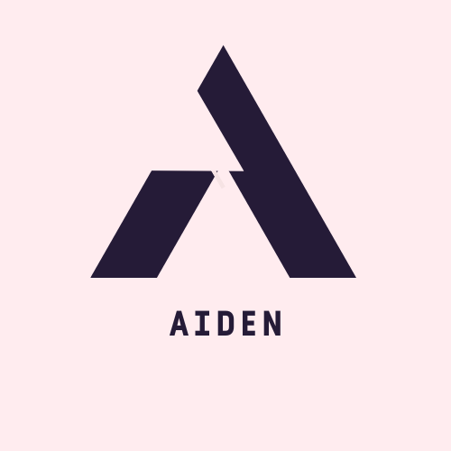

<link rel="stylesheet" href="https://cdn.jsdelivr.net/gh/devicons/devicon@v2.15.1/devicon.min.css">
<br/>
<p align="center">
  <a href="https://github.com/Aiden181/Real-Estate">
    
  </a>

  <h3 align="center">Real Estate</h3>

  <p align="center">
    This Website is cloned from a Figma Desgin: <a href="https://www.figma.com/file/gRfSkOKlkyWOaodtTJwllY/Real-Estate-Website-Landing-Page-(Community)?node-id=14%3A89">Real Estate</a>
<br/>
You can access via this link: <a href="https://aiden181.github.io/Real-Estate/">Aiden</a>
 

  

## About The Project


## Built With


<ul>
  <li>HTML5</li>
  <li>CSS3</li>
</ul


## Getting Started


### Installation

1. Clone the repo

```sh
git clone https://github.com/Aiden181/Real-Estate.git
```

### Creating A Pull Request


## Authors

* **Aiden** - *Fresher Frontend Developer* - [Aiden](https://github.com/Aiden181) - **
